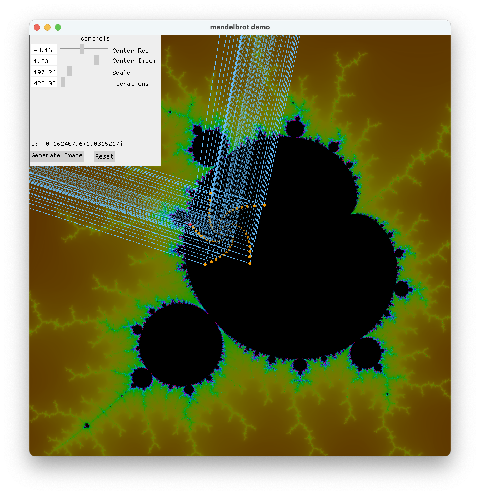

# Mandelbrot Demo
The [Mandelbrot set](https://en.wikipedia.org/wiki/Mandelbrot_set) consist of complex numbers. A complex number `C` is an element of the Mandelbrot set if the iterative equation `Zₙ₊₁ = Zₙ² + C` remains bounded as `n` approaches `∞`, starting with `Z₀ = 0`. In practice, if `|Zₙ| > 2` then the sequence will diverge, so we consider `C` to be outside the set.

# Controls
- Use the mouse to select a `C` value and observe all the `Z` values for that `C` value
- Use the sliders to select the center point on complex plane of our view.
    - Right Click will set the center point to the `C` value selected by the mouse
- Use the sliders to control the zoom factor and the number of iterations to approximate `∞`
- Click `Generate Image` to create a mandelbrot image with the current settings and resolutionF

# Build
- prerequisites
    - [Install rust](https://www.rust-lang.org/tools/install)
- `git clone https://github.com/daniel-j-anderson-dev/mandelbrot_escape_path_demo.git`
- `cd mandelbrot_escape_path_demo`
- `cargo build`
- `cargo run`

# Examples

